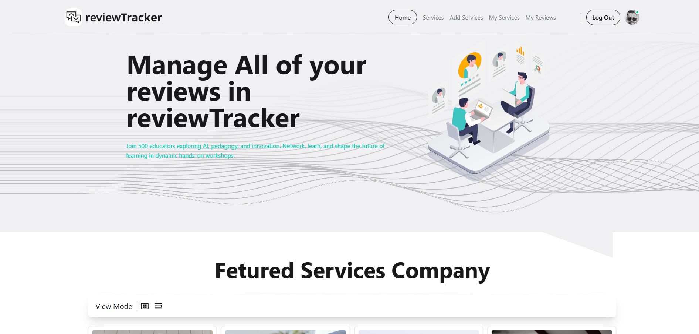

# 🛠️ Service Review Web Application

An interactive web application for browsing, reviewing, and managing services, complete with animated review displays and secure user authentication.

🔎 Project Overview

ReviewTracker lets users explore services, view detailed information, and share their experiences through reviews. Authenticated users can add new services, edit or delete their submissions, and manage their own reviews. Reviews are displayed dynamically with an engaging animated carousel powered by Framer Motio

🖼 Screenshot

---
## 🔗 Live Demo

[🌐 Live Website](https://service-review-tracker.netlify.app/)

## 🚀 Features

- 🏠 Home page with featured content
- 🔍 Browse all services
- 🧾 View service details (protected)
- ✍️ Add a new service (protected)
- 🗂️ Manage your added services (protected)
- 📝 Submit and manage your reviews (protected)
- 🔐 JWT Authentication (Sign up / Login)
- ⭐ Star rating and user photo support
- 🌐 Scrolls to top on route change
- ❌ Custom 404 Not Found page

---

## 🔐 Protected Routes

Protected using a `PrivateRoute` component that checks user authentication via context and JWT.

Pages:
- `/add-service`
- `/my-services`
- `/my-reviews`
- `/service-details/:id`

---

## 🧑‍💻 Tech Stack

**Frontend:**
- React.js
- React Router v6.4+
- Tailwind CSS
- DaisyUI
- Framer Motion
- React Icons
- Axios

**Backend:**
- Node.js
- Express.js
- MongoDB
- JWT Authentication

---

📬 Contact

Reach me at: hosenrabby.dev@gmail.com

